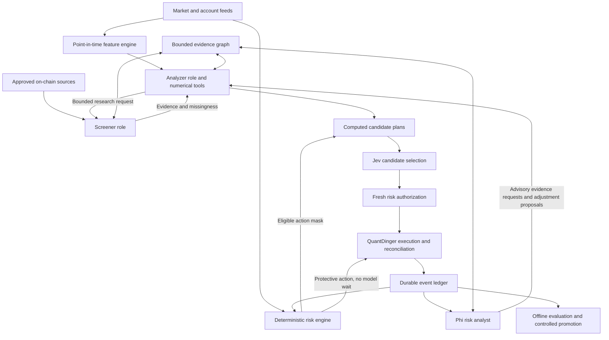

# Build specification: evidence-driven perpetual-futures trading

## 1. Objective and success criteria

Extend QuantDinger into a closed-loop research and trading system with a narrow information budget. It should discover whether specific, timely market and on-chain evidence improves net trading outcomes after fees, funding, slippage, latency and risk. It must be able to reject the hypothesis and remain out of the market.

Optimize **measured net out-of-sample performance subject to hard risk and resource constraints**. Do not optimize number of trades, model confidence, volume of data, agent conversations or backtest Sharpe in isolation. Treat memory, latency, data cost and turnover as explicit constraints and reported tradeoffs. “State of the art” is an aspiration requiring comparative evidence, not a deliverable label.

User choices: GPU deployment; perpetual futures; QuantDinger as the platform; three supporting roles sharing Phi; Jev as decision maker; graph JSON for compact memory.

Proposed starting scope: BTC and ETH linear USDT perpetuals, one venue, one-way positions, isolated margin where verified, 15-minute completed bars, an initial four-hour forecast/maximum holding horizon. A deterministic watchdog evaluates risk on fresh events and at least once per second while connected. These are engineering assumptions to validate, not claimed optimal horizons. Inverse contracts, portfolio margin, cross-exchange hedging, options, martingale and grid strategies are outside the initial implementation.

Use a simulated venue until the operator selects a real one. Do not infer venue eligibility or credentials from the user's location. Paper and replay implementation must work without paid providers.

## 2. Integrate with the real repository

Read `06_REPO_MAP_AND_SOURCES.md`. The reference audit is commit `9e3095df84c0c1631a2c7921444cc9b2150cfb24`, version `5.4.1`. Reconcile paths and behavior against the actual checkout before editing.

Reuse existing Flask/API boundaries, PostgreSQL, Redis roles, trading-worker ownership/fencing, pending-order handling, exchange adapters and audit events. Add a cohesive module with thin integration points. Do not create a competing execution engine, parallel account ledger or second strategy owner. Start from the smallest compatible runtime profile and measure the full process tree.

**Required policy change:** current AI filtering can fail open. The proposed autonomous mode must block risk-increasing orders on unavailable/invalid decisions. Make this an explicit policy such as `autonomous_evidence_v1`, with tests proving there is no LLM-fallback, no-provider, low-credit or alternate-entry-route bypass. Existing exit protections must continue independently. Document any unchanged legacy behavior outside the new mode so operators cannot confuse the two.

Current Jev integration is a pre-entry filter. Extend it with a bounded candidate-selection adapter; do not misrepresent the existing filter as already performing portfolio allocation. Avoid evaluating the same decision twice through disconnected Jev gates. Preserve necessary existing deterministic checks.

The audited code bypasses AI in existing backtests, reports funding as unmodeled, and models insolvency rather than venue-specific maintenance-margin liquidation. Its account-risk helper also appears unwired to production callers. These are explicit implementation gaps: paper/shadow must run the same new decision and risk gates as live mode, the simulator must account for funding and product-specific margin, and account-wide risk enforcement must be wired and integration-tested. Switching the execution transport must not switch off the policy being evaluated. See the pinned sources in the repository map.

## 3. Architecture and authority



Screener, analyzer coordinator and risk analyst are three logical role profiles calling **one** loaded Phi service. They are not three independent model replicas or three independent sources of truth. Jev is a separate hosted model adapter. Deterministic numerical tools may use statistical forecasting models; the one-Phi requirement is about generative-model duplication, not prohibiting useful quantitative estimators.

| Component | Allowed authority | Must not do |
|---|---|---|
| Screener/Phi | Select approved evidence requests; map evidence to hypotheses | Invent prices, search indefinitely, submit orders |
| Analyzer/Phi | Select registered numerical tools; identify missing evidence; explain outputs | Supply trusted arithmetic, generate executable strategy code at runtime |
| Quant engine | Compute features, forecasts, uncertainty, costs, scenario PnL and candidate plans | Consume future data or substitute model confidence for return estimates |
| Jev | Choose an existing eligible candidate ID or ABSTAIN | Create quantity, leverage, price, stop, credentials or new actions |
| Risk analyst/Phi | Flag changes, request stress tests, propose bounded adjustments | Authorize orders, raise limits or delay protection |
| Risk engine | Enforce policy, reserve budgets, clamp before selection, reject selected plans, initiate protection | Wait for Phi/Jev or invent account state |
| Execution | Submit authorized plans, reconcile actual orders/fills, maintain protection | Trust LLM prose or resubmit unknown orders blindly |

Only execution has exchange trading credentials. Use scoped internal calls; Phi tools cannot access arbitrary URLs, SQL, Python execution or a shell. The analyzer calls tested functions by name with validated arguments. External text is untrusted data, never instructions. Hosted Jev receives the minimum aggregate state needed; exclude credentials, personal data, raw account identifiers and unnecessary wallet histories.

## 4. Two operating loops

### Continuous protection loop

Runs in the trading/risk runtime independently of GPU availability. React to fills, order changes, account updates, mark/index changes, stale feeds, margin stress and watchdog deadlines. Recalculate positions plus pending reservations; issue audited protection under a preapproved deterministic policy. Venue-side stops should survive process outages where the adapter can verify their semantics. A stop is not a guaranteed loss bound.

### Bounded decision loop

1. Trigger on a completed decision bar, a material feature/regime change or a risk-requested reevaluation. Do not call models on every tick.
2. Establish a preliminary feature snapshot and explicit freshness requirements. The completed decision snapshot will have a cutoff after evidence acquisition; do not backdate newly retrieved information into an earlier snapshot.
3. Deterministic screening applies instrument allowlists, liquidity, freshness and basic feature rules.
4. Analyzer selects a hypothesis and a typed `ResearchRequest`: features, units, horizon, approved sources, required/optional status, freshness and budget.
5. Screener queries caches first, then authorized connectors. Return evidence, provenance, contradictions and missingness.
6. Permit at most one follow-up evidence round. If required evidence remains missing, abstain. An optional feature may be omitted only if that missing-data policy was trained and validated.
7. Numerical tools compute the forecast distribution, cost model, stress loss, feasible position changes and candidate plans. Remove numerically dominated or infeasible plans in code.
8. Risk creates a **precheck**, not an execution authorization. A partial order is not an option for the model to invent.
9. Finalize the immutable snapshot after evidence acquisition, with a final cutoff, updated freshness checks and all consumed evidence already observed and available by that cutoff. Recompute affected features/candidates if their inputs changed. Build a compact state with actual facts behind evidence IDs, metrics, classifications and eligible candidate IDs. Jev selects an ID or `ABSTAIN`.
10. Validate the response, model version, criteria membership, expiry, evidence integrity and policy status. Perform a fresh risk authorization bound to the current account version and selected plan hash.
11. Persist authorization, reservation and outbox intent atomically; execution submits and reconciles. Expired/stale decisions restart from a new snapshot instead of quietly changing the chosen plan.
12. Persist outcomes and diagnostic attribution. Mature labels enter offline evaluation only after their full horizon completes.

The model queue gives risk analysis priority over new research, but this never substitutes for the independent risk loop. Coalesce repeated research work by snapshot/instrument/strategy. Bounded retries, deadlines and cooldowns terminate all conversations. On overload discard superseded research, then block new exposure; never silently discard order/fill/account events.

## 5. Data: acquire only decision-relevant information

Maintain a source/feature registry with units, frequency, cost, rate limits, availability lag, revision policy, finality, transformations and approved use. Provenance includes vendor endpoint or record identity, retrieval time and content hash where possible. Connectors normalize data; models never manufacture missing fields.

| Data family | Initial use | Timing discipline |
|---|---|---|
| Bid/ask, depth, trades, completed OHLCV | Executability, trend, liquidity, volatility | Sequence/snapshot continuity; distinguish executable quotes from last trade |
| Mark/index, margin, orders, positions | Funding/liquidation risk and accounting | Venue/account truth; freshness stricter than research features |
| Funding schedule/rate and basis | Carry cost and crowding hypotheses | Record when estimated rate was known; settle actual funding separately |
| Open interest | Participation/crowding hypothesis | Venue methodology, units and publication lag |
| Finalized chain activity | Slow context such as transfer/activity anomalies | Block identity, finality and ingestion lag |
| Attributed exchange flows | Optional hypothesis only | Address-label provenance, version and uncertainty; no guessed exchange labels |
| News/social text | Disabled initially | Add only after a specific hypothesis and incremental-value evaluation |

Funding/open interest/order books are market data, not automatically on-chain analysis. A transfer is not automatically a sale. Net flows and activity are hypotheses, not causal proofs. A slow on-chain metric must not be presented as a fresh intrabar signal.

Store `event_time`, `available_at`, `observed_at`, `expires_at`, `revision`, source identity, quality status and units. In live decisions require knowledge available by the decision cutoff. In backtests replay actual captured arrival times, or a documented historical availability proxy; label the latter's limits. Never use today's revised history as if known in the past. All transformations inherit the latest required input availability time.

On-chain records add chain ID, contract identity where relevant, block height/hash, finalized/provisional status and transaction identity when applicable. A reorg invalidates dependent records and decisions; it does not erase previous audit events. Unknown values remain null with a reason, never zero. Prices and financial quantities use decimal/fixed-point representation at account/order boundaries.

Begin with recorded fixtures and public market data. Add at least one real on-chain connector when it can provide useful documented observations. Without point-in-time history, collect forward and mark on-chain backtests unavailable; do not claim a historical edge from synthetic fixtures. Use a plugin interface so paid sources can be added later without changing agents.

Information utility is an empirical engineering score: measured held-out improvement relative to bandwidth, provider cost, latency and memory. Use past-fold ablation evidence and its uncertainty to prioritize sources. Disable a costly source when it adds no robust value. Do not ask Phi to invent its information value.

## 6. Numerical analysis and candidate construction

Start with two separately logged hypotheses, not a huge indicator search: volatility-scaled trend/breakout, and funding/basis crowding or mean reversion conditional on a trained regime rule. These are research candidates only. Add on-chain features one family at a time. A perp/spot basis signal is not called risk-free arbitrage when the spot hedge is absent.

Use existing numerical libraries where justified. Register pure functions for returns, robust scaling, rolling volatility, liquidity/spread, funding accrual, covariance, deterministic signal generation, calibration, cost estimation, stress PnL and venue-specific sizing. Fit every learned transformation inside training folds. Implement an interpretable regularized baseline before more complex estimators. Log parameter search counts and failed trials.

For a linear contract, let `n` be contracts, `m` base units per contract, `s` side (+1 long/-1 short), and `P0, PH` mid-prices in quote currency per base unit:

```text
q_base = n * m
gross_PnL = s * q_base * (PH - P0)
net_PnL = gross_PnL - fees - execution_cost - signed_funding_payment
```

Funding received is a negative payment. Use venue settlement rules and position at each funding timestamp. If simulated fills already incorporate spread/impact, do not subtract those costs again. Estimate entry/exit fees, failed fills, latency, partial fills and size-dependent costs. Do not multiply notional fees by leverage a second time.

Prefer an empirical distribution over horizon/path outcomes to a made-up win probability. Define outcomes, holding rules and costs before evaluation. A risk-increasing candidate needs a numerical estimate of net EV and uncertainty, not just a plausible explanation. A validation-based lower bound on estimated net EV must exceed the configured hurdle. When its sample support is inadequate, abstain. A lower bound on a *mean estimate* is not a guarantee on an individual trade's loss.

Evaluate discretionary reduce/close plans by incremental utility versus continuing the existing position, counting future avoidable costs and risk, not sunk entry fees or a requirement to realize a profit. Entry sizing formulas below apply to increased exposure; reductions are bounded by the verified current position and pending reductions. Mandatory protective reductions and exits bypass the alpha hurdle and model decision entirely.

For initial sizing use a transparent stop-risk bound:

```text
loss_per_contract = m * (abs(entry - stop) + stress_slippage_per_base)
                    + stressed_fees_per_contract
                    + adverse_funding_buffer_per_contract
n_stop = available_loss_budget / loss_per_contract
n_final = floor_to_quantity_step(min(n_stop, n_exposure, n_margin,
                                    n_liquidity, n_stress, n_concentration))
```

All bounds are in contracts. For venues whose quantity already means base units, use `m=1` and explicit metadata. Require positive valid denominators; round down, then recompute margin, risk and minimum-notional feasibility. Do not round up to meet an exchange minimum. Available budget includes existing positions, open orders and uncertain submissions. This formula covers linear contracts only and is supplemented by portfolio scenarios, gap risk and liquidation checks.

Optional later portfolio optimization uses expected net returns, regularized covariance, explicit cost treatment and constrained exposures. Keep all terms in consistent units/horizons; a turnover preference must not double-count modeled trading costs. Compare against simple capped allocation. No full-Kelly sizing from Jev scores.

Each candidate contains an immutable ID/plan hash, instrument identity, entry/reduce/close action, exact quantity/contract unit, execution price envelope, stop/exit policy, time-to-live, holding horizon, required evidence IDs, forecast/model revisions, action-appropriate utility/uncertainty, estimated costs, stress loss, risk precheck and account snapshot version. Jev cannot change any of these. A postselection change to size, price envelope or stop creates a new plan hash and requires a new decision; deterministic protective action uses its own audited path. Discretionary reversal requires confirmed closing/reconciliation and a new opening authorization.

## 7. Jev decision design

Use the existing provider integration where possible. The official API contract is `POST https://api.typesafe.ai/v1/systemone`; confirm the current version and actual request/response in source. Persist provider, pinned model ID, request hash, prompt/criteria version, raw bounded response, normalized answer and latency. A moving `latest` alias invalidates calibration/replay assumptions.

Give Jev a small closed choice set: `ABSTAIN` and at most four eligible candidate IDs. Candidate descriptions contain computed facts and semantic classifications, not inaccessible graph pointers alone. Numeric comparisons, freshness and risk tests are already done in code. The selection question must be atomic; separate questions in one request cannot rely on each other's answers.

Validate that returned labels and probability keys match the allowed set, values are finite/in range, normalization is consistent with the documented contract within tolerance, and the selected answer obeys the provider contract. Malformed, missing, expired or inconsistent outputs produce no new exposure. Do not synthesize probabilities or silently repair a trading decision.

Jev choice scores express model preference over the presented labels; `confidence` is not a trading win rate. Even strong classification calibration does not establish financial calibration. Log choice score, returned confidence and empirically estimated trading outcome probabilities as different fields. Do not multiply independent-looking question scores as if they were independent evidence.

Use a separately trained and versioned acceptance rule if score thresholds add value. No universal 0.8/0.9 threshold is assumed. For research, allow observation with a declared experimental threshold; live eligibility requires locked calibration and evaluation artifacts. Always allow abstention even when every non-abstain option was prechecked.

Changing candidate count, descriptions, order, provider, model or quantization may change behavior. Test order permutations, contradictory evidence, missing values and injected text. Selection context must not imply that making a trade is required. Preserve safe fallback as **no new risk**, never a hidden replacement trading model.

## 8. Perpetual-futures risk

Hard policy is code plus validated configuration. Phi and Jev cannot edit it. Use separate `NORMAL`, `NO_NEW_RISK`, `REDUCE_ONLY`, `HALTED` and `RECOVERY` states with logged reasons. `HALTED` disables discretionary submissions; permitted protective reductions/reconciliation follow an explicit emergency policy. Unknown position state triggers reconciliation, not blind opposite-side orders.

| State | Example entry condition | Permitted behavior and recovery |
|---|---|---|
| NORMAL | Readiness and current account/data checks pass | Full authorized policy within limits |
| NO_NEW_RISK | Missing required decision/data, model outage, daily loss limit or soft drift trigger | Cancel unsafe pending entries; keep protection/reconciliation. Transient health failures may clear only after fresh checks and a configured stable interval; daily-loss lock stays until the declared reset and policy checks |
| REDUCE_ONLY | Hard exposure, margin or drawdown breach with sufficiently known positions | Deterministic approved reductions, protection and reconciliation; no size increases. Hard-limit recovery requires reconciled compliance plus operator reset |
| HALTED | Operator kill switch, integrity failure or unresolved state that prevents safe discretionary submission | Reject discretionary orders; reconcile and alert. Known-position protective actions remain permitted only under the explicit emergency policy |
| RECOVERY | Restart, regained connectivity or reset after a hard halt | Establish owner fencing and reconcile account, orders, fills and protection; return to NORMAL only after the applicable readiness/reset conditions pass |

Order of severity and combined-trigger precedence must be deterministic. A model becoming healthy does not clear a drawdown, integrity or operator lock. Configure automatic health recovery separately from hard-risk/operator resets; record all transitions.

Check account equity, available collateral, maintenance-margin tiers, liquidation buffers, effective leverage, gross/net and correlated exposures, pending reservations, concentration, drawdown, daily loss, quote age, feed gaps, clock skew, venue health and liquidity. Mark-to-market, index and executable bid/ask are separate inputs. Derive margin/liquidation calculations from the selected product's actual rules; leverage alone is insufficient.

Define daily equity reference at 00:00 UTC for the paper profile, include realized/unrealized PnL, fees and funding, and adjust for external cash flows. Persist a high-water mark for drawdown. Stop-budget sums are not portfolio tail-risk estimates; add joint BTC/ETH stress, basis dislocation, spread widening, delayed exits, funding shock and collateral impairment.

Paper profile ceilings are in `05_PAPER_CONFIG.json`. They intentionally limit research exposure; they are not live recommendations. Margin headroom rules are venue-specific and must be configured/tested before a real account can pass readiness.

Continuous adjustment rules:

- Hard breach, stale core feed, unresolved account discrepancy or model failure: block new risk immediately according to state policy.
- Protective stop/reduction/close: deterministic, audited, prioritized and bounded by verified positions; no model dependency.
- Tightening stops or reducing size: recheck venue semantics and residual risk; use hysteresis and rate limits.
- Increasing size, loosening a stop or increasing leverage: a new risk-increasing plan requiring the full authorization path. Default paper policy prohibits stop loosening and increasing leverage after entry.
- Optional Phi risk analysis runs on material changes or a slow schedule, never per tick. It can request predefined stress scenarios and explain changes.

Protection and order amendment must handle partial fills and cancel/fill races. Do not cancel the only working protective stop before a replacement is accepted unless the venue-specific procedure proves coverage. Changes to pending exposure and reservation release require reconciled state. The system must visibly report inability to place or verify protection.

## 9. Execution and accounting invariants

Reuse QuantDinger's durable machinery; fill verified gaps rather than building a parallel order manager. Persist planned submission before network send. Use stable internal intent IDs and venue-compliant client order IDs, with durable uniqueness constraints and single-owner fencing. Network delivery is not exactly once; design for idempotent effects and reconciliation.

Risk authorization binds a plan hash, maximum exposure/quantity, price envelope, expiry, account version and policy version. Revalidate at submission and reserve atomically to prevent two individually safe proposals from exceeding the total budget. The final executor never accepts unvalidated model output.

Order states include proposed, authorized, queued, submitting, acknowledged, partially filled, filled, cancel requested, canceled, rejected, expired and unknown. An HTTP timeout can mean the order exists. Query by client/venue ID and reconcile before retrying. An acknowledgement is not a fill. Deduplicate execution events by venue identity; handle corrections explicitly.

On restart, recover durable state, ownership lease and fencing; reconcile positions, open orders, fills and protective orders before new entries. Uncertain submissions continue to reserve worst-case exposure. A cancel request does not release a reservation. Actual venue state takes precedence over agent memory, with discrepancies logged and investigated.

Validate quantity/price precision, min/max sizes, position mode, contract multiplier, settlement currency, margin mode and reduce-only semantics per venue. A closing action must never accidentally reverse a position. Test supported protective order types on the selected testnet and recorded/live-shadow data; testnet fills do not prove live execution quality.

Reconcile PnL from positions, fills, fees, funding and equity changes; include unit fixtures with known results. Version fee assumptions. No withdrawal permission for trading credentials. Keep live activation behind existing QuantDinger controls plus readiness artifacts and an explicit operator action.

## 10. Graph JSON and bounded memory

Use graph structure for relationships and provenance; use JSON for validated exchange of small graph slices. JSON is not inherently memory efficient and should not hold all ticks or all blockchain transactions.

- **Operational truth:** existing PostgreSQL tables and append-only ledger/outbox.
- **Graph:** indexed node/edge tables in PostgreSQL, with typed properties, tenant/account scope and immutable evidence links. Use current database infrastructure before adding a graph database.
- **Numerical history:** partitioned compressed columnar storage, queried in bounded chunks. Reuse compatible existing stores; benchmark before introducing a new dependency.
- **Hot state:** bounded arrays/ring buffers, incremental statistics and minimal order-book depth.
- **Model context:** short JSON projections and structured summaries; no growing chat history or unbounded vector memory.

Suggested node kinds: asset, instrument, evidence, feature, hypothesis, analysis, candidate, decision, position, order, risk_event, outcome, policy. Edge kinds: about, derived_from, supports, contradicts, supersedes, invalidates, selected, authorized_by, executed_as, resulted_in, exposes_to. Correlation edges carry window, sample support and method; they do not assert causality.

Every retrievable fact must have source/provenance, availability and expiry or retention classification. Use stable IDs and content hashes, deduplicate exact evidence, retain revisions and invalidate dependent projections on reorgs/corrections. The graph stores references to bulk arrays, not their contents. Graph writes come from validated application tools, not arbitrary model patches.

Retrieve only the candidate's evidence, relevant position/risk links and a bounded number of outcomes available at the cutoff. Filter by authority, time, scope, relevance and freshness before token ranking. Limits in the paper config bound hops, node/edge count, bytes, tokens and tool rounds; whichever limit is reached first wins. Dropping optional context is allowed; silently truncating required evidence is not.

A decision record retains its exact compact context or content-addressed snapshot so replay remains possible after hot-cache expiry. Cache keys include data revisions, model/prompt/policy versions and candidate plan hashes. Invalidate model results on changed facts or expired eligibility. A cached choice is never cached risk authorization.

Retention separates raw-data replay windows, feature history, graph projections and durable audit records. Set disk quotas, monitor growth and declare when full replay is no longer available. Compression and pruning cannot delete unresolved orders, current positions, their supporting authorizations or lineage needed by retained research artifacts.

## 11. Single-Phi serving and resource budgets

Initial baseline: Microsoft's `Phi-4-mini-instruct`, a 3.8B MIT-licensed model. Pin model/tokenizer revision and runtime. Compare a supported 4-bit artifact against a higher-precision reference on this task before choosing it; record artifact hash, conversion and license. Do not blindly execute model-repository code. The model's large advertised context is not a target allocation. [Microsoft model card](https://huggingface.co/microsoft/Phi-4-mini-instruct)

One inference service owns weights. QuantDinger workers call it through a bounded local API; they must not each load Phi. Begin with one active sequence. Use the pinned runtime's supported constrained-JSON mechanism and semantic validators. Choose the simplest GPU runtime that passes compatibility and memory checks; do not run multiple runtimes simultaneously merely to compare them.

Planning estimate only: 3.8B four-bit weights have a theoretical floor near 1.9 GB before scales, unquantized layers, host copies, activations and runtime caches. For conventional transformer attention, KV bytes are approximately `2 * layers * kv_heads * head_dim * bytes_per_element * cached_tokens * active_sequences`; verify against the actual implementation. Measure total host RAM and GPU memory separately.

Starting budgets: 4,096 total tokens per Phi request including instructions/input/output, output at most 384 tokens; one active inference slot; queue at most 16 jobs with expiry; no resident conversational sessions. Jev state at most 2,000 tokens initially. Exact budgets are proposed constraints, not performance claims. Context builder reserves output space and rejects oversized required context.

Record cold/warm latency, p50/p95/p99, queue age, schema failures, tokens, GPU memory, total process-tree RAM, disk growth and feed/risk reaction latency. Reserve at least 20% measured headroom in declared host/GPU budgets. A preliminary risk-loop target is p99 under 100 ms from an accepted local event to a risk decision, excluding network execution; measure it independently of the one-second watchdog. A decision-cycle target is 30 seconds on the chosen GPU, with expired plans discarded. Adjust targets explicitly after measurement, never silently report success.

Use incremental updates and compiled/vectorized routines only where profiling demonstrates value. Optimize allocations and context before adding services. Bounded queues and protective independence matter more than impressive model throughput. GPU OOM or inference restart must not affect account reconciliation or protection.

## 12. Evaluation that can disprove the thesis

Separate four results: software correctness, model task quality, resource performance and trading evidence. Passing the first three does not prove alpha.

Use chronological walk-forward train/validation/test folds and a final untouched holdout. Purge overlapping label intervals; set embargo/gaps from the actual horizon and information overlap. Fit scalers, feature selection, imputation, return estimators, calibration, thresholds and hyperparameters only in appropriate training/validation data. Record all trials to assess selection bias. No random time-series split.

Replay point-in-time universes, delistings, contract changes, funding times and source revisions. Execute after signal availability; never fill using the bar close that became known only after the modeled order time. Model stop/target ambiguity with finer data or a declared conservative rule. Include size/latency/cost stresses and realistic partial/unfilled orders.

Current pretrained models can contaminate historical testing through learned future information. Anonymized numeric replay reduces some leakage without proving its absence. Freeze policies and conduct prospective shadow/paper evaluation for the model-dependent claims. Live-like data collection and operational soaking are necessary; a fixed number of calendar days is not sufficient statistical evidence.

Required paired ablations under identical data, capital, exposure/risk budgets and execution models:

1. Cash and a simple exposure-matched benchmark.
2. Deterministic numerical policy using existing execution/risk, without Phi or Jev.
3. Same policy plus targeted Phi screening/analysis, deterministic final choice.
4. Same inputs and candidate set with Jev selection.
5. Remove on-chain data; remove each costly source; compare compact versus larger contexts.
6. Compare selected Phi quantization with a reference on schema validity, evidence grounding, tool selection and downstream decisions.

Report paired net performance differences with dependence-aware uncertainty, not independent-trade assumptions. Preserve cross-asset dependence in resampling. Report return, volatility, drawdown, tail/stress loss, turnover, exposure, fills, costs, funding, calibration where labels justify it, abstention, capacity and performance by regime. Use multiple-testing adjustments/selection diagnostics appropriate to the research search. Do not invent independent sample size from highly overlapping trades.

Use two complementary comparisons: frozen shared candidate/snapshot sets to isolate Jev's decision contribution, and separate full portfolio replays per policy to capture its effects on future positions, capital and opportunities. Never force all portfolio paths to share one policy's account state after their choices diverge.

Before each evaluation register an economic hurdle, confidence-interval method, minimum effective sample support and acceptable risk/resource limits in a versioned manifest. Reject promotion if required fields are unresolved. A statistical significance result must also survive costs and have practical value. If Jev adds no robust value, report that result; keep its authority disabled rather than replacing the evidence standard with a good story.

## 13. Closed-loop adaptation

Online: update market/account state, deterministic features, prevalidated filters, reservations and permitted risk reductions. Drift monitors compare distributions, error, costs and data quality; they can reduce exposure or suspend new entries.

Offline: propose a new feature set, model parameters, calibration, prompt or source policy; train and evaluate it as a challenger with frozen versions. A champion/challenger registry records data windows, results, resource footprint and rollback artifacts. No self-edited live Python, no self-approved risk-cap increases and no “learn from the last losing trade” prompt mutation.

Promotion requires correctness tests, locked research criteria, prospective evidence and an operator-controlled deployment change. Automatic switching may be added later only among preapproved policies inside an explicit envelope and with separately validated rules. The safe default is abstain/reduce, not continuous exploration with live funds.

## 14. Required payloads and interfaces

Implement strict, versioned types; reject unknown keys and invalid units. `03_CONTRACTS.schema.json` supplies starter contracts. Complete the remaining interfaces before integration:

| Payload/interface | Required content |
|---|---|
| ResearchRequest | Hypothesis, instrument, horizon, feature requests, requiredness, units, freshness, sources, budget |
| EvidenceResult | Evidence IDs, values/status, provenance, timestamps, revisions, contradictions and missing reasons |
| ToolRequest/ToolResult | Registered function/version, arguments, input IDs, deterministic output, units and errors |
| AnalysisPacket | Snapshot, hypothesis, computed forecasts/costs/uncertainty, sample support, candidate IDs, missingness |
| CandidatePlan | Immutable proposed action and numerical/risk precheck evidence; never executable alone |
| DecisionReceipt | Allowed/selected ID, provider/model/version, probabilities distinct from win probability, expiry, trace |
| RiskAuthorization | Plan hash, account/policy versions, reservations, max size, price envelope, expiry, approval/rejection |
| OrderIntent/OrderEvent/Fill | Stable IDs, venue/account scope, status/version, precise quantities/prices/fees and dedupe key |
| RiskEvent/AdjustmentProposal | Trigger, state transition, bounded action, position references, evidence and resolution |
| Outcome/ExperimentManifest | Mature labels, full cost accounting, versions, folds, trial registry and acceptance results |
| GraphSlice | Typed bounded nodes/edges, cutoff, provenance references and explicit truncated/missing indicators |

All messages carry schema version, event ID, correlation ID, producer, creation/cutoff/expiry times and revision references where applicable. Internal auth supplies account/tenant scope; a model cannot choose another account. Cross-record validators check IDs, availability, precision, action masks, hashes, expiry and authorization. JSON Schema does not replace these validators.

## 15. Implementation phases and reviewable outputs

### Phase 0 — discovery and compatibility

Map the actual source, tests and API contracts. Record hardware when available; select a provisional Phi runtime; identify venue/data unknowns. Produce a short architectural decision record and a gap list. Verify the current Jev fallback/convergence behavior and all execution routes. Do not install every optional QuantDinger service.

### Phase 1 — deterministic paper slice

Implement contracts/config, recorded fixtures, point-in-time features, one deterministic strategy, simulated linear-perp accounting, risk states/reservations, durable execution/reconciliation, graph projection and replay. Fake Phi/Jev adapters have explicit fake labels. Demonstrate one eligible paper trade, one abstention, one partial fill, one risk reduction and one restart recovery with linked audit records.

### Phase 2 — real model adapters

Add one resident Phi service, role prompts, allowlisted numerical tools, structured validation and bounded conversation. Add the hosted Jev candidate selector using the existing client. Test failures offline with fixtures; perform contract/inference checks only when accessible. Do not substitute successful mocks for unavailable live verification.

### Phase 3 — relevant on-chain evidence

Add one approved connector, finality/revision handling and analyzer-driven retrieval. Capture forward availability. Show that irrelevant or expired facts are excluded and a missing required fact leads to abstention. Benchmark information value against the no-on-chain variant.

### Phase 4 — research and resource report

Run walk-forward evaluation and ablations, cost/latency/capacity stress, task-specific quantization comparison and a 24-hour minimum engineering soak. The soak is an operational test, not an alpha threshold. Measure and report budgets; fix leaks or overruns. Begin prospective paper collection where statistically adequate evidence is not yet available.

### Phase 5 — operational readiness

Deliver a paper runbook, dashboards/API views, backups/recovery, incident actions, rollback, version manifest and live-readiness checklist with real unresolved items. Keep live mode disabled. A later live pilot requires explicit selected-venue configuration, tested protection and operator-approved limits/readiness; no hardcoded paper defaults become live authority.

Within each phase, build and test a working vertical slice before expanding. Continue independent work when optional credentials/data are missing. Clearly list external gates that cannot be demonstrated locally.

## 16. Acceptance tests and failure scenarios

The meaningful test suite must establish:

- Future or subsequently revised evidence cannot enter a past decision; missing data never becomes zero.
- Reorgs and source corrections invalidate dependent candidate eligibility while preserving audit history.
- Phi/Jev malformed output, timeout, low-credit/no-provider fallbacks, injected text and GPU OOM cannot create new unauthorized risk or disable protection.
- Failed durable decision/audit persistence prevents new entries; unsupported strategy types or disabled gates cannot silently join autonomous mode. Paper/shadow uses the same selection and risk policy as live, with only execution transport changed.
- Multiple proposals, partial fills and uncertain submissions cannot exceed aggregate reservations and exposure limits.
- Ack loss, duplicate events, cancel/fill races, worker restart and stale fencing tokens cannot create duplicate intended exposure.
- Instrument rounding, linear contract multipliers, fees, signed funding, marks and partial fills match independent accounting fixtures.
- Stop protection and position reductions never reverse positions; cancellation does not prematurely release reservations.
- Model output cannot alter hard caps, venue/account scope, credentials, execution tool permissions or configuration.
- Replay with recorded structured decisions reproduces deterministic event/accounting outputs; rerunning a model is a separate experiment, not assumed bitwise deterministic.
- Queue/context/graph/retention limits hold under sustained load; all critical events are durable and overloaded research expires safely.
- Historical evaluation and paired ablations report failures and uncertainty honestly; no live-readiness approval exists without the required artifacts.

Finish with actual run commands/results, files changed, benchmarks on named hardware, data/model/version hashes, failed/unverified checks and a concise operator demo. A polished dashboard is optional until these requirements work.
