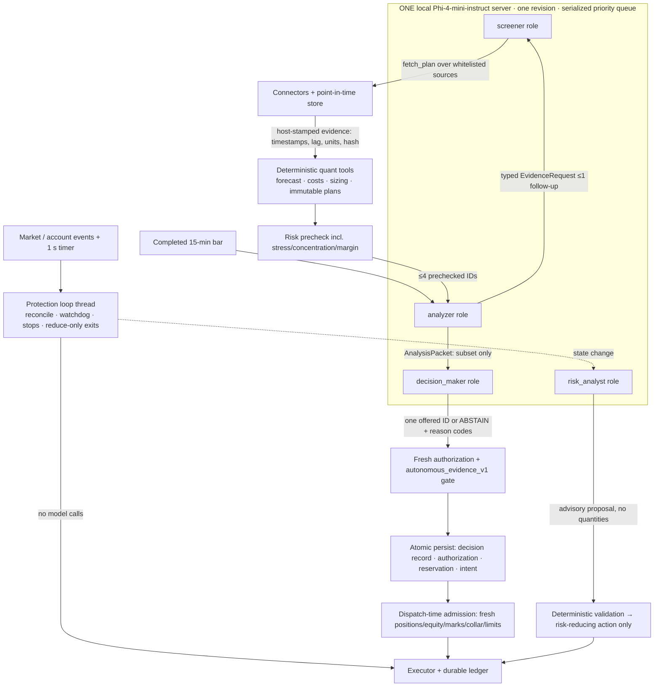

# claude-quant-crypto: one local Phi model, four roles, deterministic risk (paper only)

A **paper-only** research and trading system for BTC and ETH linear USDT perpetuals.

- **One Phi model does all the language work.** It serves the screener, analyzer, decision_maker and
  risk_analyst roles through one inference service (one endpoint, one model revision, one serialized
  admission queue).
- **Deterministic code owns every trusted number.** That covers forecasts, costs, sizing, hard risk,
  authorization, protective exits, execution and accounting.
- **Jev is only a design inspiration.** Phi makes a bounded, auditable choice among at most four
  immutable candidate IDs plus `ABSTAIN`. There is no Jev or Open-Jev model, service or dependency
  (see `docs/ADR-002-one-phi-model.md`).

> **Status: live trading is disabled and cannot be enabled by configuration.** Everything here ran on
> **labeled synthetic market data** with a **labeled rule-based fake Phi backend**. The build container
> had no GPU and no Hugging Face, exchange or chain egress. The real Phi HTTP path is implemented and
> tested against a local OpenAI-compatible stub, not against Phi itself. **Nothing here is evidence of
> a trading edge or of model value.** See `docs/GAPS_AND_UNVERIFIED.md`.

## Architecture



## Quick start

```bash
python -m pip install -e '.[test]'     # numpy, jsonschema, pytest
python -m pytest -q                    # 64 tests
python -m cqc faults                   # 24 fault scenarios -> reports/fault_injection.md
python -m cqc demo                     # one backend, four roles, linked audit chain -> reports/demo_report.md
python -m cqc evaluate                 # paired ablations P0..P4 -> reports/evaluation_report.md
python -m cqc soak --days 14           # simulated-time soak (RSS, DB growth, graph size, latencies)
python -m cqc readiness                # lists every unresolved live/promotion blocker (exit 1)
python -m cqc check-phi                # GPU host only: one call per role through the configured Phi server
python -m cqc bench-phi --endpoint reference=URL --endpoint candidate=URL --ledger LEDGER   # GPU host only
python -m cqc validate --phase all     # research program: frozen manifest, trials, robustness, ONE sealed holdout
```

**Supported platform.** Linux, Python 3.10+ is the tested target, and all results were produced
there. `python -m cqc --help` no longer needs the Unix-only `resource` module: it is imported lazily,
and on Windows peak RSS is read through `PeakWorkingSetSize`. There is a test for this. Windows
itself has not been run.

**Validation program.** `docs/VALIDATION_REPORT.md` has the gate table and all results,
`research/` holds the frozen manifest and the hash-chained trial log, and `reports/validation/`
holds the raw JSON. The final holdout has already been evaluated once, and the program refuses to
evaluate it again. Any new study needs a new versioned manifest.

## Guarantees enforced in code (and tested)

| Guarantee | Where | Test / scenario |
|---|---|---|
| All four roles use the same backend and model revision; at most one inference runs at a time; risk work is admitted first | `llm/phi.py` `PhiService`, `InferenceQueue` | `four_roles_one_backend`, `test_inference_is_serialized_and_risk_work_is_admitted_first` |
| The decision can only be an offered ID or `ABSTAIN` (schema enum per call, plus a host check) | `selection.py`, `llm/phi.py:role_schema` | `phi_decision_invent_candidate`, `test_decision_off_menu_or_server_error_means_abstain` |
| No probabilities are manufactured (`calibrated_selection_probability` must be null) | `contracts.decision_record` | `test_decision_record_forbids_probabilities_and_off_menu_selection` |
| Timeout, OOM, malformed output, overload, oversized context or a budget overrun mean `ABSTAIN` or a blocked cycle | `selection.py`, `runtime.py` | `phi_decision_*`, `phi_*` scenarios |
| Protection never waits for Phi | `protection.py`, `runtime.protect` | `slow_phi_does_not_delay_protection` |
| Entries are re-validated on fresh state immediately before sending | `risk.admission_check`, `runtime._admission` | `admission_account_changed`, `admission_price_collar` |
| The stress limit is enforced by the precheck itself, not only by sizing | `risk.precheck` | `test_stress_room_is_enforced_by_precheck_independently_of_sizing` |
| Bounded evidence dialogue: typed request, whitelisted fetch, host-stamped evidence, at most one follow-up round | `runtime._evidence_dialogue` | `phi_injected`, `missing_required_evidence` |
| On-chain data without proven historical availability is excluded from replays | `onchain.Connector.historical_availability_proven` | registry logic in `runtime._variables` |
| Legacy Open-Jev records are identified, never replayed or accepted | `contracts.LEGACY_EVENT_KINDS`, `policy.check_entry` | `legacy_jev_ledger` |
| Risk-analyst advice is only applied after deterministic validation; it can only reduce risk | `runtime.apply_proposal` | `test_risk_analyst_proposals_are_validated_and_bounded_in_code` |

## Module map

| Module | Responsibility |
|---|---|
| `cqc/llm/phi.py` | The single Phi service: backends (fake, OpenAI-compatible, recorded replay), admission queue, schemas, metrics |
| `cqc/llm/prompts.py` | Versioned prompts for the four roles (`roles_v2`, `decision_v1`) |
| `cqc/selection.py` | `PhiDecisionSelector` and the `DeterministicRankSelector` baseline, both producing `decision_record`s |
| `cqc/runtime.py` | Paper runtime: protection, evidence dialogue, candidates, decision, authorization, admission, risk-analyst application, graph retention |
| `cqc/protection.py` | Threaded protection loop (event- and timer-driven), independent of inference |
| `cqc/risk.py` | Locks and states, watchdog, precheck (stop risk, gross, symbol, margin, stress), authorization, dispatch admission |
| `cqc/execution.py`, `cqc/venue.py`, `cqc/ledger.py` | Durable intents, reservations and fencing; simulated venue; reconciliation |
| `cqc/contracts.py`, `cqc/pit.py`, `cqc/onchain.py`, `cqc/graph.py`, `cqc/quant.py` | Contracts, point-in-time evidence, connectors, bounded graph, numerical tools |
| `cqc/faults.py`, `cqc/demo.py`, `cqc/evaluate.py` | Fault injection, operator demo, paired ablations |

## Operator runbook (paper)

- **Start/restart.** A worker takes the fencing lease, enters `RECOVERY`, reconciles, then returns
  to `NORMAL`. Ledgers written by the superseded Open-Jev path are flagged as
  `legacy_records_detected` and treated as audit-only.
- **Kill switch.** `RiskEngine.operator_halt(now)`. Only `clear_lock("operator_halt", now,
  operator=True)` clears it.
- **Lock clearing.** Phi health, audit-failure, stale-feed and reconciliation locks clear
  automatically after a stable interval. The risk-analyst advisory `NO_NEW_RISK` lasts 15 minutes.
  `daily_loss` clears at 00:00 UTC. `drawdown` needs an operator.
- **What to watch.** The `admission_rejected`, `risk_event`, `protective_action`, `order_unknown`,
  `adjustment_applied`/`adjustment_not_applied` and `risk_analyst_unavailable` events, plus the
  `summary()` latency blocks and the `phi` resource summary.
- **Replay.** Recorded Phi outputs (`phi_raw_response`) replay through `RecordedPhiBackend`.
  `Ledger.trading_digest()` shows identical plans, orders, fills and outcomes. The replay's decision
  records name the replay backend, so a replay is never mistaken for a live model run.
- **Changing prompts or parameters.** New prompts and parameters must be versioned, evaluated offline
  and released through an operator gate. Nothing self-modifies live policy.
